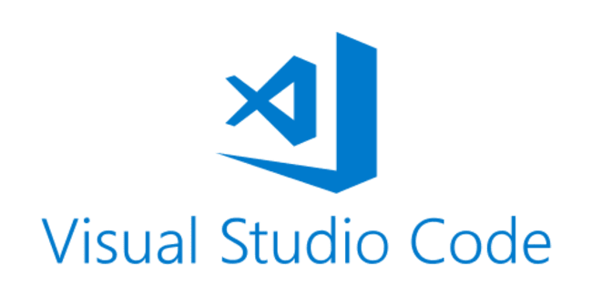

<figure class="half">
	
	
</figure>

<figure class="half">
  
  
</figure>

En este primer posteo, lo que haremos será:

1. ***Crear un proyecto con Hardhat***
2. ***Conectar nuestra cuenta de Metamask con Hardhat y Ethers js.***
3. ***Resolver 1 desafío de CTE con nuestro entorno ya listo.***
